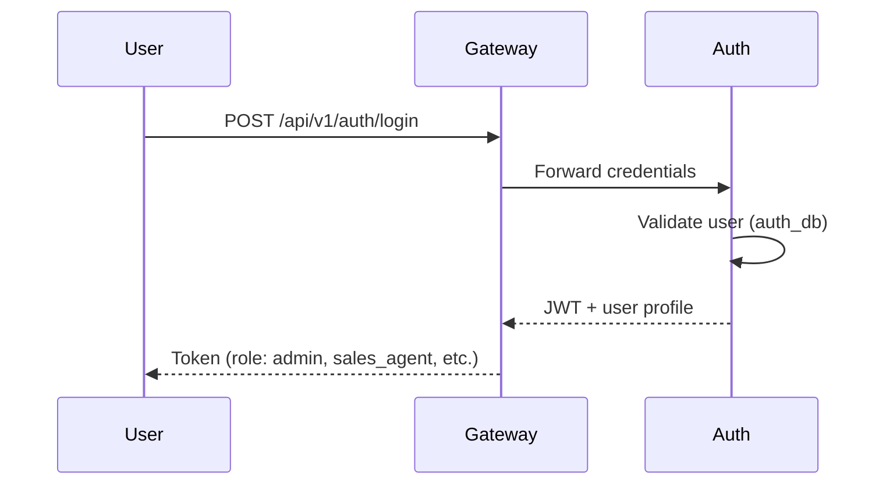
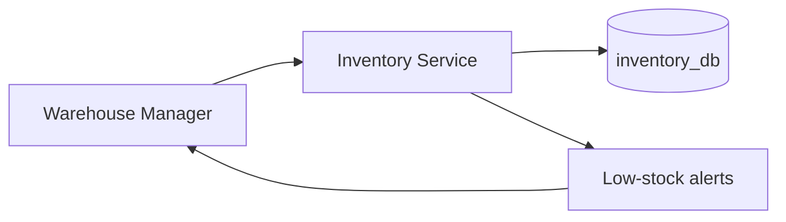
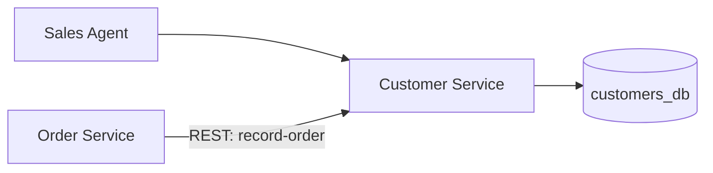
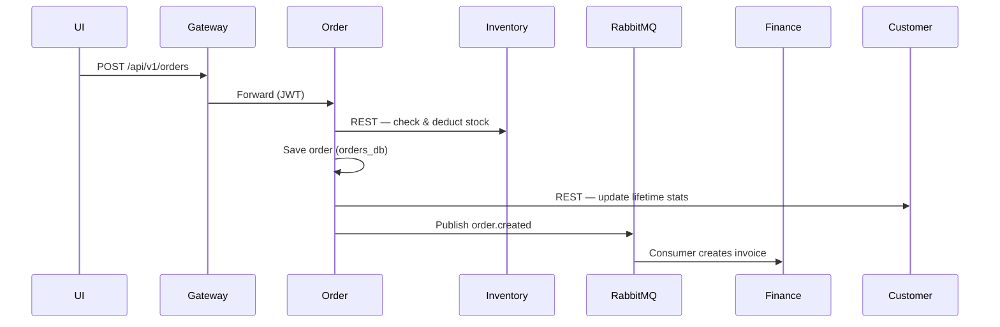
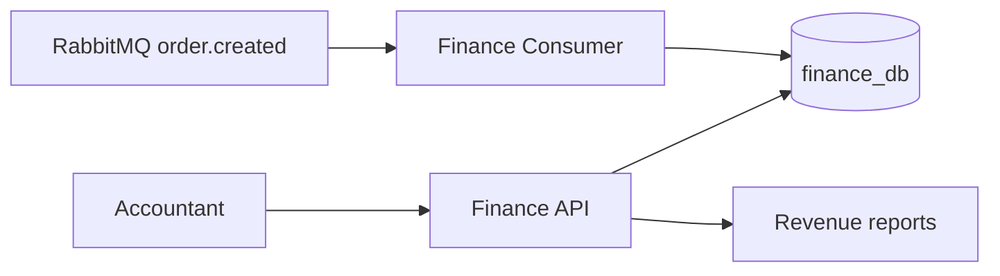

# PageCraft Books — Business Documentation

**Endterm Mini ERP System | Online Bookstore & E-commerce Retailer**

---

## 1. Company Profile

| Field | Detail |
|-------|--------|
| **Company name** | PageCraft Books |
| **Industry** | Online bookstore / e-commerce retailer |
| **Size** | Small business — 25 employees |
| **Locations** | Headquarters: Cebu City, Philippines; warehouse: Mandaue City; online-only sales nationwide |
| **Mission** | To make quality books accessible across the Philippines through a reliable online store backed by efficient inventory and order fulfillment. |

PageCraft Books sells new and popular titles (fiction, non-fiction, academic, young adult). Orders are placed online or by sales agents; a central warehouse picks, packs, and ships. Finance issues invoices and tracks payments (GCash, PayMaya, COD, card).

---

## 2. Organizational Structure

```
                    CEO / Owner
                         │
         ┌───────────────┼───────────────┐
         │               │               │
    Operations        Sales &          Finance &
    (Warehouse)       Marketing         Admin
         │               │               │
   Warehouse Mgr    Sales Agents      Admin / Accountant
   Stock Clerks     Customer Svc
```

| Department | Roles | ERP interaction |
|------------|-------|-----------------|
| Operations | Warehouse Manager, Stock Clerks | Inventory, stock alerts, order fulfillment status |
| Sales & Marketing | Sales Agents, Customer Service | Customers (CRM), order placement, order tracking |
| Finance & Admin | Admin, Accountant | Invoices, revenue reports, user management |
| External | Customer (registered shopper) | Browse catalog, place own orders (limited) |

---

## 3. Core Business Processes (5+)

### Process 1 — User Authentication & Access Control

Staff and customers authenticate before using protected features. JWT tokens are issued by the Auth Service; the API Gateway validates every request.



**Business need:** Secure access by role; prevent unauthorized changes to stock, pricing, or financial records.

---

### Process 2 — Inventory & Stock Management

Books are catalogued with ISBN, price, cost, and stock levels. Warehouse staff add/update titles; the system flags low-stock items.



**Business need:** Avoid overselling and stockouts; maintain accurate catalog for sales.

---

### Process 3 — Customer Relationship Management (CRM)

Sales agents register customers, track status (new, active, VIP), and view order history summaries (total orders, lifetime value updated when orders complete).



**Business need:** Personalized service and visibility into customer value.

---

### Process 4 — Sales Order Placement & Fulfillment

When an order is placed, stock is checked and deducted synchronously; customer stats are updated; an async event triggers invoicing.



**Business need:** Reliable order capture with real-time stock accuracy and automatic billing.

---

### Process 5 — Finance & Invoicing

Each completed order generates a pending invoice. Accountants mark invoices paid or voided; revenue reports support management decisions.



**Business need:** Audit trail for sales; cash flow visibility.

---

### Process 6 — Order Cancellation & Stock Restoration

Cancelled orders (pending/processing) restore inventory quantities via compensating REST calls to Inventory.

**Business need:** Recover sellable stock when orders fall through.

---

## 4. Pain Points Addressed

| Pain point | How the ERP resolves it |
|------------|-------------------------|
| Overselling books online | Real-time stock check and deduct before order confirmation (Order → Inventory REST) |
| Manual invoice creation | Async invoice generation via RabbitMQ when orders are placed |
| Scattered customer data | Central CRM with lifetime value and order counts |
| No role-based access | JWT + role middleware (admin, warehouse, sales, customer) |
| Siloed spreadsheets for stock | Dedicated Inventory microservice with low-stock alerts |
| Slow cross-team handoffs | Event-driven finance; single API Gateway for all clients |

---

## 5. User Roles & Permissions Matrix

| Capability | Admin | Warehouse Manager | Sales Agent | Customer |
|------------|:-----:|:-----------------:|:-----------:|:--------:|
| Login / profile | ✓ | ✓ | ✓ | ✓ |
| Manage users (auth) | ✓ | — | — | — |
| Books — view catalog | ✓ | ✓ | ✓ | ✓ |
| Books — CRUD | ✓ | ✓ | — | — |
| Stock alerts | ✓ | ✓ | ✓ | — |
| Customers — CRUD | ✓ | — | ✓ | — |
| Place orders | ✓ | — | ✓ | ✓ |
| View all orders | ✓ | view | ✓ | own |
| Update order status | ✓ | ✓ | ✓ | — |
| Invoices — view | ✓ | — | ✓ | — |
| Invoices — mark paid/void | ✓ | — | — | — |
| Revenue reports | ✓ | — | ✓ | — |

Enforced in each microservice via `VerifyJwtToken` + `CheckRole` middleware after Auth Service validates the JWT.

---

## 6. Traceability: Business → Technical

| Business need | Microservice | Communication |
|---------------|--------------|---------------|
| Secure login | auth-service | JWT issuance |
| Single entry for apps | api-gateway | HTTP proxy + auth check |
| Book catalog & stock | inventory-service | REST API |
| Sales orders | order-service | REST + RabbitMQ publish |
| Customer profiles | customer-service | REST API |
| Invoicing & reports | finance-service | RabbitMQ consume + REST |
| Real-time stock on order | order → inventory | **REST (sync)** — justified: must not sell unavailable stock |
| Invoice after order | order → finance | **RabbitMQ (async)** — justified: billing must not block checkout |

---

*Export this document to PDF for submission (Section 5 of the project brief).*
